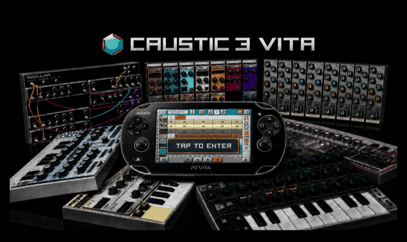

# Caustic 3 Vita

<p align="center">
  
</p>

An unofficial, non-commercial PlayStation Vita wrapper for **Caustic 3**, the
mobile music workstation created by **Rej Poirier / Single Cell Software**.

This project loads Caustic's original Android ARMv7 native library on Vita,
recreates the small Android/JNI environment it expects, translates its
graphics, audio, input, and filesystem calls, and packages the result as a Vita
application. It is a compatibility wrapper—not a decompilation, rewrite,
emulator, crack, or ownership claim over Caustic.

> **Project status: public beta.** The wrapper is functional on physical Vita
> hardware, but the 01.01 security-hardened build still needs broader hardware
> regression testing. Read [Known limitations](#known-limitations) before use.

## Highlights

- Native ARMv7 execution through a TheFlow-style shared-object loader
- OpenGL ES 2 rendering translated through vitaGL/vitaShaRK
- Caustic 44.1 kHz audio resampled to Vita's 48 kHz output
- Built-in and headset microphone input resampled back to 44.1 kHz
- Front-panel multi-touch, including polyphonic keyboard input
- Optional physical controls with an on-screen focus indicator
- Fullscreen 960×544 presentation and paced UI transitions
- Project, preset, sample, skin, save, export, and data-directory support
- First-launch extraction of factory content from the user's own APK
- Custom Vita bubble and LiveArea assets
- Two supported Caustic binary profiles selected by cryptographic hash
- Central path policy protecting Vita storage from crafted Caustic paths
- Reproducible source-only build flow with private temporary staging
- Published security audit, findings, coverage, and hardening record

See [FEATURES.md](docs/FEATURES.md) for the detailed compatibility matrix.

## Credits and lineage

This port would not exist without the groundwork in
[Trackelf/caustic3-vita-wrapper](https://github.com/Trackelf/caustic3-vita-wrapper).
Thank you to **Trackelf** for publishing the original Vita wrapper scaffold and
documenting the community port effort.

Deep thanks also go to **Rej Poirier / Single Cell Software**, the creator of
Caustic, for building an unusually powerful music workstation and making the
final Android maintenance build freely available to users. “Free to download”
does not mean open source or public domain: Caustic, its engine, artwork,
factory content, name, and trademarks remain the property of their respective
rights holders.

The Vita work in this repository was developed and hardware-tested by
**trappunk (Tennis Rodman)** in July 2026, with extensive assistance from
**OpenAI Codex**. The AI disclosure is intentionally explicit; see
[AI_ASSISTANCE.md](docs/AI_ASSISTANCE.md).

Additional foundations include VitaSDK, vitaGL, vitaShaRK, kubridge, FalsoJNI,
the Vita Android-wrapper community, TheFloW's loader techniques, and work by
Rinnegatamante and other Vita homebrew contributors. See [CREDITS.md](CREDITS.md).

## What is and is not included

This repository contains only redistributable project material:

- Vita wrapper and compatibility source
- Build scripts and host-side tests
- Vita package metadata and original project branding
- Documentation and security-audit artifacts

It does **not** contain:

- A Caustic APK
- `libcaustic.so`
- A compiled VPK or eboot
- Caustic factory assets
- Unlock packages or license-bypass code
- Third-party preset, song, sample, or skin collections

You must supply your own legally obtained, supported APK. The build script
rejects unknown APK and native-library hashes. Do not open an issue asking for
copyrighted files or download links.

## Runtime requirements

- A homebrew-enabled PlayStation Vita
- `kubridge.skprx`
- `libshacccg.suprx`
- The normal vitaGL-compatible runtime setup
- Sufficient space under `ux0:/data/CAUSTIC3/`

PSVshell overclocking is optional but recommended for demanding projects.
System-plugin installation is outside this repository; follow the current
documentation for each plugin and do not install conflicting I/O-fix plugins.

## Build overview

The VitaSDK and all linked graphics/math dependencies must use the compatible
`softfp` ABI. With the environment ready:

```sh
./scripts/build-vpk.sh /absolute/path/to/supported-caustic.apk
```

Outputs:

- `build-new/Caustic3Vita.vpk` for the supported 3.3.2.0 demo profile
- `build-full322/Caustic3Vita.vpk` for the supported 3.2.2 full322 profile

Optional locally owned extras can be placed under `extras/` and packaged with:

```sh
CAUSTIC_INCLUDE_EXTRAS=1 ./scripts/build-vpk.sh /path/to/supported.apk
```

Nothing under `extras/` is distributed here. You are responsible for having
permission to package and redistribute anything you add.

Complete instructions: [BUILDING.md](docs/BUILDING.md).

## Controls

Touch is the default and physical controls start disabled.

| Input | Action |
|---|---|
| Triangle | Toggle physical-control mode |
| D-pad | Move the focus cursor |
| Cross | Grab/release the focused control; D-pad adjusts while grabbed |
| Start | Toggle transport play/stop |
| Select | Open machine management |
| Left stick up/down | Swipe between instrument racks |
| Front touch | Normal Caustic touch and multi-touch input |

More detail: [CONTROLS.md](docs/CONTROLS.md).

## How it works

```text
User-supplied APK
    ├── lib/armeabi-v7a/libcaustic.so ──> ARM ELF loader/import resolver
    └── assets/ ───────────────────────> packaged/extracted Caustic data

Caustic native calls
    ├── Android/JNI lifecycle ─────────> FalsoJNI compatibility layer
    ├── GLES2 ─────────────────────────> vitaGL + vitaShaRK
    ├── audio output ──────────────────> 44.1 kHz → 48 kHz SceAudioOut
    ├── microphone ────────────────────> 48 kHz → 44.1 kHz callback
    ├── touch/controller ──────────────> synthesized native touch events
    └── Android filesystem paths ──────> confined Vita path policy
```

See [ARCHITECTURE.md](docs/ARCHITECTURE.md) for the loader, lifecycle,
rendering, audio, input, data, and packaging design.

## Security review

On 2026-07-13, the maintained repository received a repository-wide,
AI-assisted static security review covering 73 maintained files and the shipped
native import surface. It produced three validated findings:

1. **Medium:** microphone capture begins at application launch and continues
   for the session. This remains open pending a reliable record-state signal.
2. **Low:** path escape through the `fopen` compatibility bridge. Fixed in
   01.01 by the shared path policy.
3. **Low:** path escape through `open`/`__open_2`. Fixed in 01.01 by the same
   policy.

The audit is transparent but is **not an independent human penetration test**.
The proprietary, stripped Caustic parser/server internals could not be audited
without source. Read [SECURITY.md](SECURITY.md) and the
[full audit report](docs/audit/2026-07-13/report.md).

## Known limitations

- Microphone audio is currently captured continuously while the app is open.
  The wrapper does not write those samples to a file, but this can affect
  privacy, battery life, and performance headroom.
- USB MIDI input is not supported. The Vita does not provide a conventional
  USB-OTG host path for class-compliant MIDI devices.
- The controller layer synthesizes touch events and may need per-screen tuning.
- Some unusually heavy projects or presets may exceed Vita performance or
  memory limits.
- The proprietary Caustic engine is a stripped binary; internal parsers are
  outside this source audit.
- The 01.01 path-policy build is source-verified and packaged successfully but
  should be hardware regression-tested before replacing a known-good install.

## Testing and diagnostics

Runtime diagnostics are written to:

```text
ux0:/data/CAUSTIC3/debug.log
```

When reporting a reproducible crash, include that log, the wrapper version,
the screen/action that triggered the problem, and any Vita `C2-12828-1` dump.
Do not upload copyrighted projects or private recordings without permission.

See [TESTING.md](docs/TESTING.md) for the release checklist.

## Legal

This project is unofficial and unaffiliated with Sony, Single Cell Software,
or the original Caustic developer. It is intended for preservation,
interoperability research, and non-commercial community use. No infringement
or ownership of Caustic is intended. See [LEGAL.md](docs/LEGAL.md) and
[LICENSE.md](LICENSE.md).

## Contributing

Bug reports, reproducible Vita logs, documentation, and narrowly scoped source
improvements are welcome. Do not submit proprietary APKs, native libraries,
factory content, third-party packs, secrets, or generated VPKs.

See [CONTRIBUTING.md](CONTRIBUTING.md).
